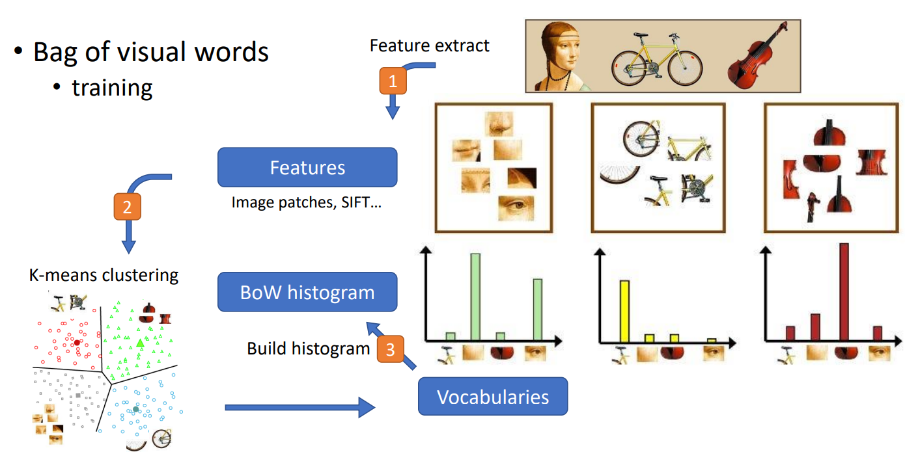
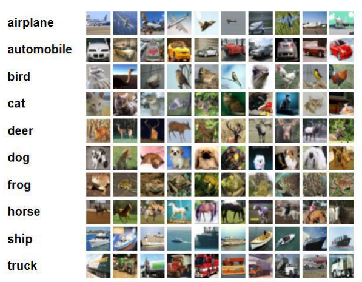

# Recognition and Classification
A impletment for Bag-of-Words Scene Recognition, including Tiny image method and Bag of SIFT method.




A impletment for CNN based Image Classification.



## Usage
### Requirement (prerequisite: conda)
Type the following command in your terminal, you should have conda to build the environment.

```sh
git clone https://github.com/willychen0146/Recognition-and-Classification.git
cd Recognition-and-Classification
# build the environment
bash build.sh
```

### Dataset preparation
The data should be put like the following structure first
```sh
data
├─p1_data
│  ├─test
│  │  ├─Bedroom
│  │  ├─Coast
│  │  ├─Forest
│  │  ├─Highway
│  │  ├─Industrial
│  │  ├─InsideCity
│  │  ├─Kitchen
│  │  ├─LivingRoom
│  │  ├─Mountain
│  │  ├─Office
│  │  ├─OpenCountry
│  │  ├─Store
│  │  ├─Street
│  │  ├─Suburb
│  │  └─TallBuilding
│  └─train
│      ├─Bedroom
│      ├─Coast
│      ├─Forest
│      ├─Highway
│      ├─Industrial
│      ├─InsideCity
│      ├─Kitchen
│      ├─LivingRoom
│      ├─Mountain
│      ├─Office
│      ├─OpenCountry
│      ├─Store
│      ├─Street
│      ├─Suburb
│      └─TallBuilding
└─p2_data
    ├─train
    ├─unlabel
    └─val
```
### Bag-of-Words Scene Recognition

```sh
# simply run the script
# you can change feature, classifier, dataset_dir in the script if you want.
p1/p1_run.sh
```
### CNN based Image Classification
```sh
# simply run the script
# you can change the hyperparameters setting for training in config.py

# training
# you can change the dataset_dir for training
p2/p2_run_train.sh

# testing (for inference and evaluation)
# you can change the argument for testing in p2_run_test.sh
p2/p2_run_test.sh
```